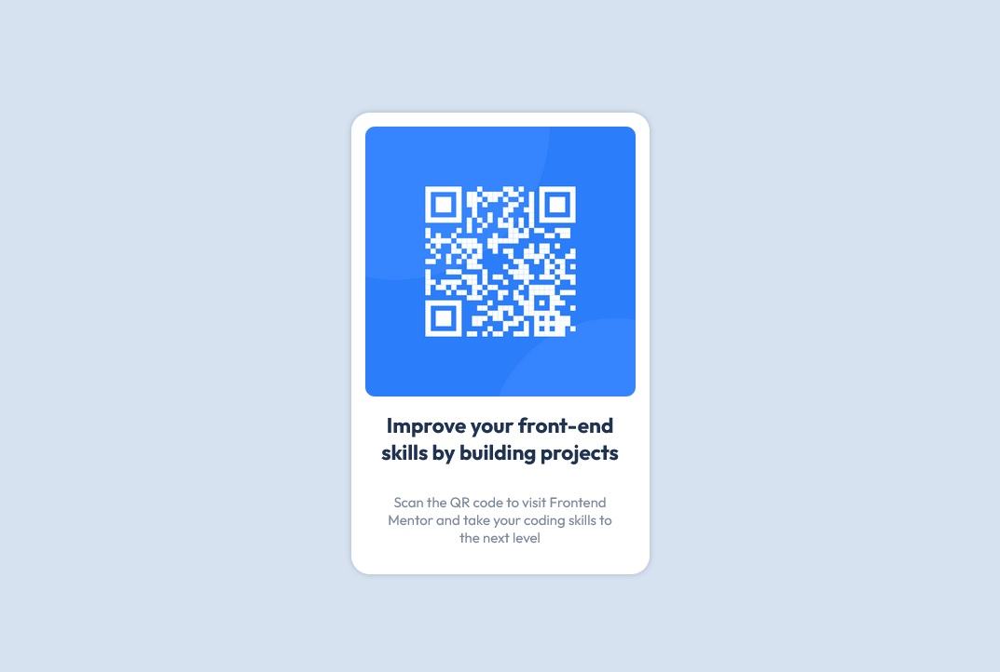

# Frontend Mentor - QR code component solution

This is a solution to the [QR code component challenge on Frontend Mentor](https://www.frontendmentor.io/challenges/qr-code-component-iux_sIO_H). Frontend Mentor challenges help you improve your coding skills by building realistic projects. 

## Table of contents

- [Overview](#overview)
  - [Screenshot](#screenshot)
  - [Links](#links)
- [My process](#my-process)
  - [Built with](#built-with)
  - [What I learned](#what-i-learned)
  - [Useful resources](#useful-resources)
- [Author](#author)

## Overview

### Screenshot

### Links

- Solution URL: [Front-end Mentor](https://www.frontendmentor.io/solutions/qr-code-component-using-flexbox-layout-IgCCI2AWBu)
- Live Site URL: [Github Pages](https://pedroncios.github.io/frontend-mentor-qr-code/)

## My process

### Built with

- Flexbox

### What I learned

This challenge was interesting to get familiar with some CSS properties and proportional size units, like ``em``, ``rem``, ``vh`` and ``vw``. It also helped me to remember some basics about **flexbox** layout.

### Useful resources

- [Flexbox Guide](https://css-tricks.com/snippets/css/a-guide-to-flexbox/) - Guide which helped me to center the main card with flexbox.
- [Modern CSS Units](https://desenvolvimentoparaweb.com/css/unidades-css-rem-vh-vw-vmin-vmax-ex-ch/) - Article (in portuguese) that helped me understand modern CSS size units.

## Author

- LinkedIn - [Pedro Yamada Bondal](https://www.linkedin.com/in/pedro-yamada-bondal-b0050122/)
- Frontend Mentor - [@pedroncios](https://www.frontendmentor.io/profile/pedroncios)
